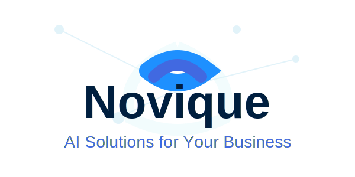

# Novique.ai - AI Solutions for Small Business

A modern, responsive website built with Next.js 15, TypeScript, and Tailwind CSS for Novique.ai, an AI consulting company targeting small businesses.



## 🚀 Overview

This website provides a complete online presence for Novique.ai, featuring:

- **Homepage** with 7 key sections (Hero, Problem, Solution, How It Works, Examples, Testimonials, About)
- **Solutions Page** showcasing AI services
- **About Page** introducing the team and mission
- **Contact Page** with inquiry form
- **Consultation Booking** with detailed scheduling form
- **Privacy & Terms** pages for legal compliance

## 🛠️ Tech Stack

- **Framework**: [Next.js 15](https://nextjs.org/) with App Router
- **Language**: TypeScript
- **Styling**: Tailwind CSS
- **Forms**: React Hook Form
- **Animations**: Framer Motion
- **Deployment**: Vercel (recommended)

## 📋 Prerequisites

- Node.js 18.17 or later
- npm, yarn, or pnpm package manager
- Git

## 🏗️ Installation

### 1. Clone the Repository

```bash
git clone <your-repo-url>
cd novique.ai
```

### 2. Install Dependencies

```bash
npm install
# or
yarn install
# or
pnpm install
```

### 3. Run Development Server

```bash
npm run dev
# or
yarn dev
# or
pnpm dev
```

Open [http://localhost:3000](http://localhost:3000) in your browser to see the website.

## 📁 Project Structure

```
novique.ai/
├── app/                      # Next.js App Router pages
│   ├── about/               # About Us page
│   ├── consultation/        # Booking page
│   ├── contact/             # Contact page
│   ├── privacy/             # Privacy Policy
│   ├── solutions/           # Solutions/Services page
│   ├── terms/               # Terms of Service
│   ├── globals.css          # Global styles
│   ├── layout.tsx           # Root layout
│   └── page.tsx             # Homepage
├── components/              # Reusable React components
│   ├── home/               # Homepage-specific sections
│   │   ├── HeroSection.tsx
│   │   ├── ProblemSection.tsx
│   │   ├── SolutionSection.tsx
│   │   ├── HowItWorksSection.tsx
│   │   ├── ExampleSolutionsSection.tsx
│   │   ├── TestimonialsSection.tsx
│   │   └── AboutSection.tsx
│   ├── Button.tsx          # Reusable button component
│   ├── ContactForm.tsx     # Contact form
│   ├── ConsultationForm.tsx # Consultation booking form
│   ├── Footer.tsx          # Site footer
│   ├── Header.tsx          # Site header/navigation
│   ├── Logo.tsx            # Logo SVG component
│   └── Section.tsx         # Section wrapper
├── public/                  # Static assets
│   ├── images/             # Image files
│   └── logo.svg            # Company logo
├── lib/                     # Utility functions
├── .eslintrc.json          # ESLint configuration
├── .gitignore              # Git ignore rules
├── next.config.ts          # Next.js configuration
├── package.json            # Project dependencies
├── postcss.config.mjs      # PostCSS configuration
├── README.md               # This file
├── tailwind.config.ts      # Tailwind CSS configuration
└── tsconfig.json           # TypeScript configuration
```

## 🎨 Design System

### Colors

The design uses a subtle blue and green color palette inspired by the Novique.ai logo:

- **Primary Blues**: #1e90ff (Dodger Blue), #4169e1 (Royal Blue), #001f3f (Navy)
- **Accent Cyans**: #a0d8ef, #e0f7fa
- **Secondary Greens**: Various shades for trust and growth

### Typography

- **Font**: Inter (Google Font)
- **Weights**: Regular (400), Semibold (600), Bold (700)

### Components

All components follow a consistent design pattern:
- Generous spacing and padding
- Rounded corners (rounded-lg, rounded-2xl)
- Subtle shadows for depth
- Hover states for interactivity

## 📝 Forms Configuration

### Email Integration (To Do)

Forms are currently set up with React Hook Form but need integration with an email service:

**Option 1: EmailJS** (Recommended for quick setup)
1. Sign up at [EmailJS](https://www.emailjs.com/)
2. Create email templates
3. Update form components with your EmailJS credentials

**Option 2: Custom API**
1. Create API routes in `app/api/`
2. Set up your email service (SendGrid, AWS SES, etc.)
3. Update form components to use your API endpoints

### Environment Variables

Create a `.env.local` file for sensitive credentials:

```env
# EmailJS (if using)
NEXT_PUBLIC_EMAILJS_SERVICE_ID=your_service_id
NEXT_PUBLIC_EMAILJS_TEMPLATE_ID=your_template_id
NEXT_PUBLIC_EMAILJS_PUBLIC_KEY=your_public_key

# Or your custom API keys
EMAIL_API_KEY=your_api_key
```

## 🚢 Deployment

### Deploying to Vercel (Recommended)

1. **Push to GitHub**:
```bash
git init
git add .
git commit -m "Initial commit"
git remote add origin <your-github-repo-url>
git push -u origin main
```

2. **Deploy to Vercel**:
   - Visit [vercel.com](https://vercel.com)
   - Sign in with GitHub
   - Click "New Project"
   - Import your `novique.ai` repository
   - Vercel will auto-detect Next.js and configure settings
   - Click "Deploy"

3. **Configure Domain** (Optional):
   - In Vercel dashboard, go to your project settings
   - Navigate to "Domains"
   - Add your custom domain (e.g., novique.ai)
   - Follow DNS configuration instructions

### Alternative: Vercel CLI

```bash
# Install Vercel CLI
npm i -g vercel

# Deploy
vercel

# Deploy to production
vercel --prod
```

## 🔧 Customization

### Update Contact Information

1. **Footer.tsx**: Update social links and contact info
2. **Contact page**: Update email/phone numbers
3. **Consultation page**: Update contact details

### Add Blog (Future Enhancement)

The current design doesn't include a blog, but you can add one:

1. Create `app/blog/` directory
2. Add `page.tsx` for blog listing
3. Create `app/blog/[slug]/page.tsx` for individual posts
4. Consider using a CMS like Sanity or Contentful

### Modify Colors

Edit `tailwind.config.ts` to change the color scheme:

```typescript
colors: {
  primary: {
    // Your custom colors here
  }
}
```

## 📱 Responsive Design

The website is fully responsive with breakpoints:
- **Mobile**: < 768px
- **Tablet**: 768px - 1024px
- **Desktop**: > 1024px

All components are tested across devices for optimal viewing.

## ♿ Accessibility

- Semantic HTML structure
- ARIA labels for interactive elements
- Keyboard navigation support
- Focus visible states
- Alt text for images
- Color contrast compliance

## 🧪 Testing

Run ESLint:
```bash
npm run lint
```

Build for production (tests for errors):
```bash
npm run build
```

## 📈 SEO Optimization

Each page includes:
- Meta titles and descriptions
- OpenGraph tags for social sharing
- Semantic HTML structure
- Image optimization with Next/Image
- Sitemap (to be generated)

### Generate Sitemap (Optional)

Install `next-sitemap`:
```bash
npm install next-sitemap
```

Create `next-sitemap.config.js` and run after build.

## 🐛 Troubleshooting

### Common Issues

**Issue**: Forms not submitting
- **Solution**: Check browser console for errors. Ensure form integration is set up (EmailJS or API).

**Issue**: Images not loading
- **Solution**: Verify image URLs in components. Update Unsplash URLs if needed.

**Issue**: Build errors
- **Solution**: Run `npm run lint` and fix any TypeScript/ESLint errors.

## 🤝 Contributing

This is a private project for Novique.ai. If you're part of the team:

1. Create a feature branch
2. Make your changes
3. Test thoroughly
4. Submit a pull request

## 📄 License

Copyright © 2025 Novique.ai. All rights reserved.

## 📞 Support

For questions or issues:
- **Email**: hello@novique.ai
- **Phone**: (555) 123-4567

---

**Built with ❤️ using Next.js, TypeScript, and Tailwind CSS**
